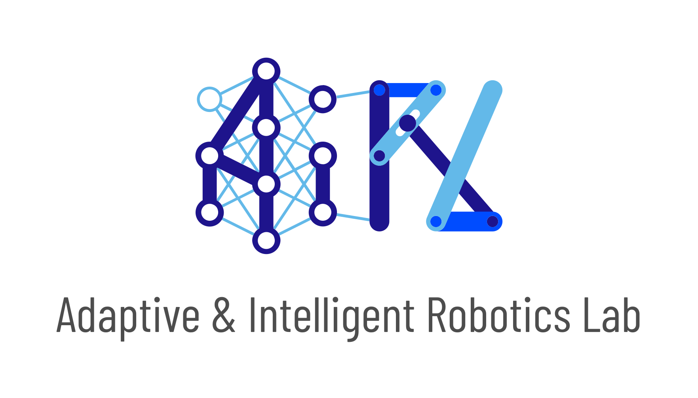
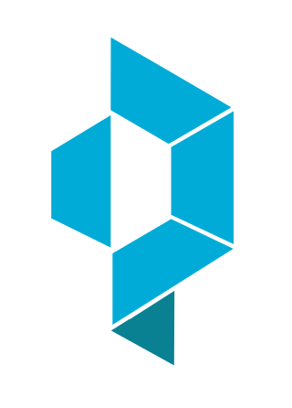

# A. My Work and Contribution

This repo contains two of my Imperial College London projects:

- [Independent Study Option (ISO)](#ISO): **Model-Based Uncertainty Quantification in the context
of Reinforcement Learning and Quality-Diversity** (09/01/2023 - 02/05/2023)
- [Individual Research Project (IRP)](#IRP): **Model-Based Uncertainty Quantification for
Quality-Diversity Optimisation** (10/05/2023 - 11/09/2023) 

## A.1. Independent Study Option <a name="ISO"></a>

This 1<sup>st</sup> project consists mainly of studying the literature and work relating to **Quality-Diversity optimization algorithms**, as well as more classical **Reinforcement Learning algorithms**. This project is particularly interested in the problems and use of QD algorithms in **stochastic environments**.  
To limit the impact of noise, various **sampling approaches** have been discussed and proposed in the literature. Unfortunately, QD algorithms are not particularly data-efficient, and adding more sampling methods doesn't help. Performance and solution evaluation are better, but this comes at a cost in terms of computing and data resources.  
One method of limiting the impact of noise while improving data efficiency performance is **to use a model** to learn the dynamics of the environment and quantify the uncertainty. This model aims **to understand the input-output relationship of environmental data** while abstracting as much as possible from noise. An expected consequence is **better data efficiency**, assuming the model is properly trained. Using the model to evaluate a solution can be likened to a *free cost* compared with evaluation by the scoring function associated with the environment.

For this project, I was mainly interested in the operation and implementation of the **MAP-Elites** and **MAP-Elites Sampling** algorithms. The aim was also to familiarize myself with and observe the interactions between a deterministic environment, a stochastic environment and the associated metrics, notably uncorrected and corrected.  
The environment considered here is **a redundant robotic arm** composed of **N joints**. The objective is **to control this robotic arm** belonging to a 2D plane to reach all possible positions of this arm while **minimizing the control variance of all joints**.

<center>

| Algorithm | Description | Main | Class | Results |
| :---   | :---: | :---: | :---: | :---: |
| MAP-Elites (ME) | Classical ME algorithm | [ME Main](ME_arm.py) | [ME Class](qdax/core/map_elites.py) | [ME Results](results_sim_arg/ME/) |
| MAP-Elites Sampling (MES) | ME algorithm where solutions are reevaluated | [MES Main](MES_arm.py) | [MES Class](qdax/core/map_elites_UQD.py) | [MES Results](results_sim_arg/MES/) |

</center>

For this project, the open-source [**QDax**](#QDax) library was used and adapted to become familiar with QD algorithms written in JAX. This library is the result of a fruitful collaboration between researchers at **InstaDeep** and **Imperial College London's Adaptive and Intelligent Robotics Lab**.

The **project report** of this ISO can be found [here](Reports/ISO_Report.pdf).

## A.2. Individual Research project <a name="IRP"></a>

This 2<sup>nd</sup> project is part of my **master's thesis** at Imperial College London. It is a continuation of the project presented in the previous section.  
The literature remains quite similar, although this project focuses much more on the implementation and understanding of model-based approaches and uncertainty quantification.

As a result, **8 new algorithms** are proposed, with the two baselines MAP-Elites and MAP-Elites Sampling introduced in the previous section serving as a point of comparison.

<center>

| Algorithm | Description | Main | Class | Results |
| :---   | :---: | :---: | :---: | :---: |
| MBME Explicit (MBME Exp) | ME with (1) a model, and (2) an explicit sampling approach | [MBME Exp Main](MEMB_explicit_naive_multi_wipe.py) | [MBME Exp Class](qdax/core/map_elites_MB_explicit_naive.py) | [MBME Exp Results](results_sim_arg/MEMB_Explicit_Naive/) |
| MBME Explicit Wipe (MBMEW Exp) | ME with (1) a model, (2) an explicit sampling approach, (3) a reset of the repertoire | [MBMEW Exp Main](MEMB_explicit_naive_multi_wipe.py) | [MBMEW Exp Class](qdax/core/map_elites_MB_explicit_naive.py) | [MBMEW Exp Results](results_sim_arg/MEMB_Explicit_Naive_Wipe/) |
| MBMEUQ Explicit (MBMEUQ Exp) | ME with (1) a model quantifying the uncertainty, and (2) an explicit sampling approach | [MBMEUQ Exp Main](MEMBUQ_NLL_explicit_naive_multi_wipe.py) | [MBMEUQ Exp Class](qdax/core/map_elites_MBUQ_NLL_explicit_naive.py) | [MBMEUQ Exp Results](results_sim_arg/MEMBUQ_NLL_Explicit_Naive/) |
| MBMEUQ Explicit Wipe (MBMEUQW Exp) | ME with (1) a model quantifying the uncertainty, (2) an explicit sampling approach, and (3) a reset of the repertoire | [MBMEUQW Exp Main](MEMBUQ_NLL_explicit_naive_multi_wipe.py) | [MBMEUQW Exp Class](qdax/core/map_elites_MBUQ_NLL_explicit_naive.py) | [MBMEUQW Exp Results](results_sim_arg/MEMBUQ_NLL_Explicit_Naive_Wipe/) |
| MBME Implicit (MBME Imp) | ME with (1) a model, and (2) an implicit sampling approach | [MBME Imp Main](MEMB_implicit_multi_wipe.py) | [MBME Imp Class](qdax/core/map_elites_MB_implicit.py) | [MBME Imp Results](results_sim_arg/MEMB_Implicit/) |
| MBME Implicit Wipe (MBMEW Imp) | ME with (1) a model, (2) an implicit sampling approach, (3) a reset of the repertoire | [MBMEW Imp Main](MEMB_implicit_multi_wipe.py) | [MBMEW Imp Class](qdax/core/map_elites_MB_implicit.py) | [MBMEW Imp Results](results_sim_arg/MEMB_Implicit_Wipe/) |
| MBMEUQ Implicit (MBMEUQ Imp) | ME with (1) a model quantifying the uncertainty, and (2) an implicit sampling approach | [MBMEUQ Imp Main](MEMBUQ_implicit_multi_wipe.py) | [MBMEUQ Imp Class](qdax/core/map_elites_MBUQ_implicit.py) | [MBMEUQ Imp Results](results_sim_arg/MEMBUQ_Implicit/) |
| MBMEUQ Implicit Wipe (MBMEUQW Imp) | ME with (1) a model quantifying the uncertainty, (2) an implicit sampling approach, and (3) a reset of the repertoire | [MBMEUQW Imp Main](MEMBUQ_implicit_multi_wipe.py) | [MBMEUQW Imp Class](qdax/core/map_elites_MBUQ_implicit.py) | [MBMEUQW Imp Results](results_sim_arg/MEMBUQ_Implicit_Wipe/) |

</center>

The **explicit sampling approach** consists of having a smaller batch of solutions than the **implicit approach**, but each solution has been re-evaluated several times to make them more reliable and of better quality.  
A model that **quantifies uncertainty** will predict 6 outputs, i.e. the mean and standard deviation of the fitness, of the BD of the position in X and of the BD of the position in Y. A model that **does not quantify uncertainty** will not look at the mean and standard deviation but directly at the value of fitness and BD, thus proposing 3 values for each evaluation.  
Finally, the **repertoire reset** consists of emptying the archive after each model training session and re-evaluating the solutions contained therein. The aim is to improve the prediction of solutions following a more correctly trained model while avoiding lucky solutions.

Alongside these algorithms, other methods and analyses had to be developed to enable them to function, and to understand, compare and interpret the various results:

1. Repertoires Comparison (Best simulation)
   - [Repertoires script](analysis_repertoire.py)
   - [Repertoires results](results_sim_arg/Containers_Comparison/)
2. Metrics Comparison (Best simulation)
   - [Metrics script](analysis_metrics.py)
   - [Metrics results](results_sim_arg/Metrics_Comparison/)
3. GridSearch and Hyperparameters Comparison
   - [GridSearch script](analysis_hyperparameters.py)
   - [GridSearch results](GridSearch_Comparison/)
4. Algorithms Replications Comparison
   - [Replications script](analysis_replication.py)
   - [Replications classical metrics results](results_sim_arg/Metrics_Comparison/Replicated/)
   - [Replications new metrics results](results_sim_arg/Metrics_Comparison/Replicated_Stds/)
   - [Replications loss metrics results](results_sim_arg/Loss_Comparison/)
5. Model Analysis and Performances
   - [Model analysis script](NN_analysis.py)
   - Model results: see the folder of each algorithm [here](results_sim_arg/)
6. Various methods to enable visual plots, statistical analysis of outliers, or calculation of new metrics and loss
   - [Other methods](annexed_methods.py)
7. A FIFO buffer used as a training/testing set and adapted to both non-UQ and UQ algorithms
   - [Buffer](qdax/core/neuroevolution/buffers/buffer.py)
8. A MAP-Elites repertoire adapted to UQ algorithms
   - [UQ repertoire](qdax/core/containers/mapelites_repertoire_UQ.py)
9. Implementation of a new scoring function to compare both deterministic and stochastic environments
   - [New Scoring Function](qdax/tasks/arm.py)
   - [Sampling and Reevaluation](qdax/core/stochasticity_utils_UQ.py)
   - [Main script](MEMBUQ_NLL_explicit_naive_multi_wipe_both.py)
   - [Class script](qdax/core/map_elites_MBUQ_NLL_explicit_naive_both.py)
   - [Results](results_sim_arg/MEMBUQ_NLL_Explicit_Naive_Both_Wipe/)
10. Implementation of a Z-score normalization method to adjust the model prediction scale
    - [Main script](MEMBUQ_NLL_explicit_naive2.py)
    - [Class script](qdax/core/map_elites_MBUQ_NLL_explicit_naive2.py)
    - [Results](results_sim_arg/MEMBUQ2_NLL_Explicit_Naive/)

As previously, this project is based on the open-source [**QDax**](#QDax) library.  
The **project report** of this IRP can be found [here](Reports/IRP_Report.pdf).

# B. Acknowledgements 

I would like to extend my sincere gratitude to [Dr. Antoine Cully](https://www.imperial.ac.uk/people/a.cully) for graciously accepting my collaboration at his esteemed [Adaptive and Intelligent Robotics Lab (AIRL)](https://www.imperial.ac.uk/adaptive-intelligent-robotics/) starting in January. Working alongside Dr. Cully and his two exceptional PhD candidates, [Manon Flageat](https://scholar.google.com/citations?user=W9Pm_KYAAAAJ&hl=en) and [Bryan Lim](https://limbryan.github.io/), has been an incredible opportunity.

Throughout the duration of these two projects, Dr. Antoine Cully, Manon Flageat, and Bryan Lim have exhibited the utmost professionalism and expertise. Their continuous guidance, unwavering support, and invaluable insights have played an integral role in my progress and development.

Once again, I extend my deepest thanks to Dr. Antoine Cully, Manon Flageat, and Bryan Lim for their exceptional mentorship and dedication. I am immensely grateful for the privilege to work with such remarkable individuals, and their contributions have undoubtedly enriched my experience in the Adaptive and Intelligent Robotics Lab.

<div align="center">
 
</div>

<div align="center">
<a href="https://github.com/Aneoshun" title="Antoine Cully"></a>
<a href="https://github.com/manon-but-yes" title="Manon Flageat"></a>
<a href="https://github.com/limbryan" title="Bryan Lim"></a>
</div>

# C. Reference - QDax: Accelerated Quality-Diversity <a name="QDax"></a>

<div align="center">
</img>
</div>

QDax is a tool to accelerate Quality-Diversity (QD) and neuro-evolution algorithms through hardware accelerators and massive parallelization. QD algorithms usually take days/weeks to run on large CPU clusters. With QDax, QD algorithms can now be run in minutes! ⏩ ⏩ 🕛

QDax has been developed as a research framework: it is flexible and easy to extend and build on and can be used for any problem setting. Get started with simple example and run a QD algorithm in minutes here! [](https://colab.research.google.com/github/adaptive-intelligent-robotics/QDax/blob/main/examples/mapelites.ipynb)

- QDax [paper](https://arxiv.org/abs/2202.01258)
- QDax [documentation](https://qdax.readthedocs.io/en/latest/)

QDax was developed and is maintained by the [Adaptive & Intelligent Robotics Lab (AIRL)](https://www.imperial.ac.uk/adaptive-intelligent-robotics/) and [InstaDeep](https://www.instadeep.com/).

<div align="center">
 
</div>

<div align="center">
<a href="https://github.com/limbryan" title="Bryan Lim"></a>
<a href="https://github.com/maxiallard" title="Maxime Allard"></a>
<a href="https://github.com/Lookatator" title="Luca Grilloti"></a>
<a href="https://github.com/manon-but-yes" title="Manon Flageat"></a>
<a href="https://github.com/Aneoshun" title="Antoine Cully"></a>
<a href="https://github.com/felixchalumeau" title="Felix Chalumeau"></a>
<a href="https://github.com/ranzenTom" title="Thomas Pierrot"></a>
<a href="https://github.com/Egiob" title="Raphael Boige"></a>
<a href="https://github.com/valentinmace" title="Valentin Mace"></a>
<a href="https://github.com/GRichard513" title="Guillaume Richard"></a>
<a href="https://github.com/flajolet" title="Arthur Flajolet"></a>
<a href="https://github.com/remidebette" title="Rémi Debette"></a>
</div>

```
@article{lim2022accelerated,
  title={Accelerated Quality-Diversity for Robotics through Massive Parallelism},
  author={Lim, Bryan and Allard, Maxime and Grillotti, Luca and Cully, Antoine},
  journal={arXiv preprint arXiv:2202.01258},
  year={2022}
}
```
